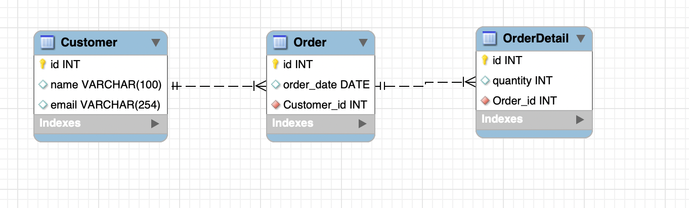

# HW-05 Django Migrations

## Diagramas de Base de Datos

Diagrama de base de datos, desde el primer modelo hasta el modelo final

### Paso 1 - Customer

### Paso 2 - + Order

### Paso 3 - + OrderDetail

### Paso 4 - + Product

