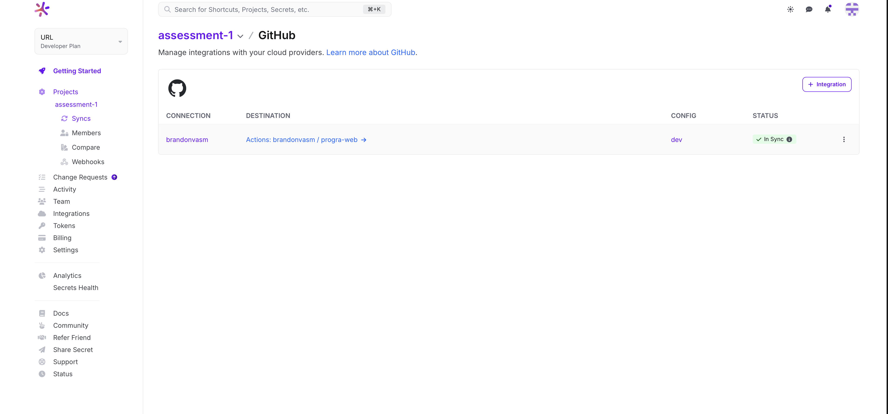
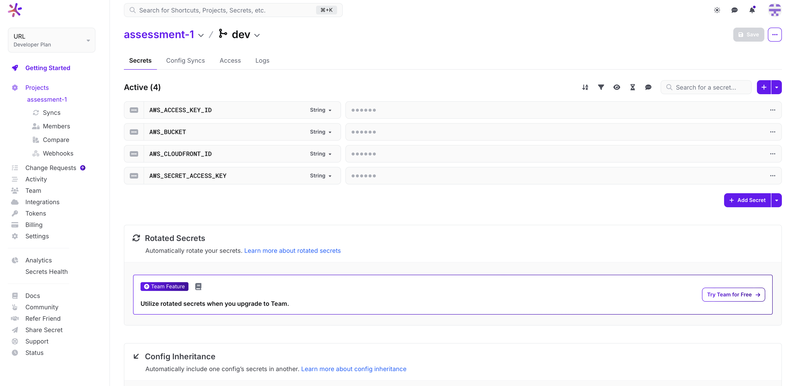
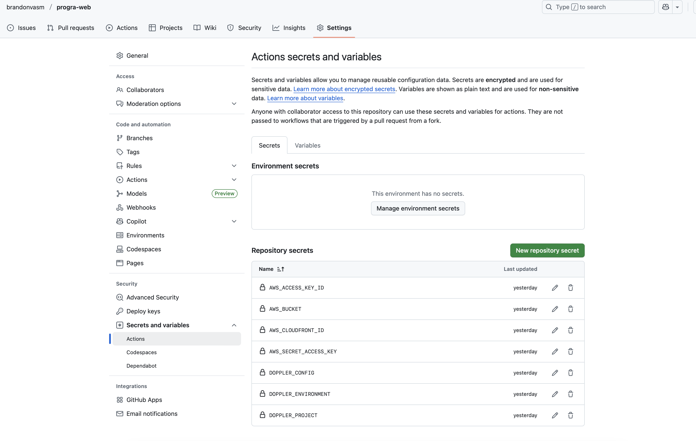
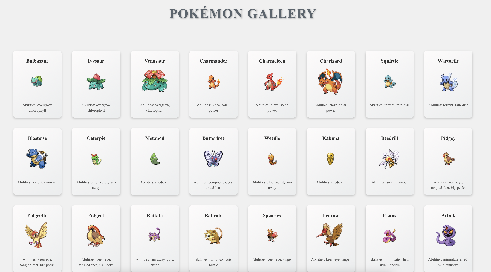

# Pokémon Gallery - Assessment 1

Este proyecto es una aplicación web que muestra una galería de tarjetas con información de Pokémon obtenida dinámicamente desde la PokeAPI. La aplicación está desplegada en un CDN de AWS y el pipeline de GitHub Actions automatiza el build y despliegue.

---

## 1. Integración Doppler con GitHub
Captura de la pestaña **Config Syncs** en Doppler mostrando la integración con este repositorio:

---

## 2. Variables de Doppler
Captura de las variables configuradas en Doppler (ocultando valores sensibles):

---

## 3. Secretos en GitHub
Captura de los secretos 

---

## 4. Captura de la aplicación

---

## 5. URL pública del CDN
La aplicación puede ser accedida desde la siguiente URL:

[Acceder a Pokémon Gallery](https://d2usrrye4gyuns.cloudfront.net)